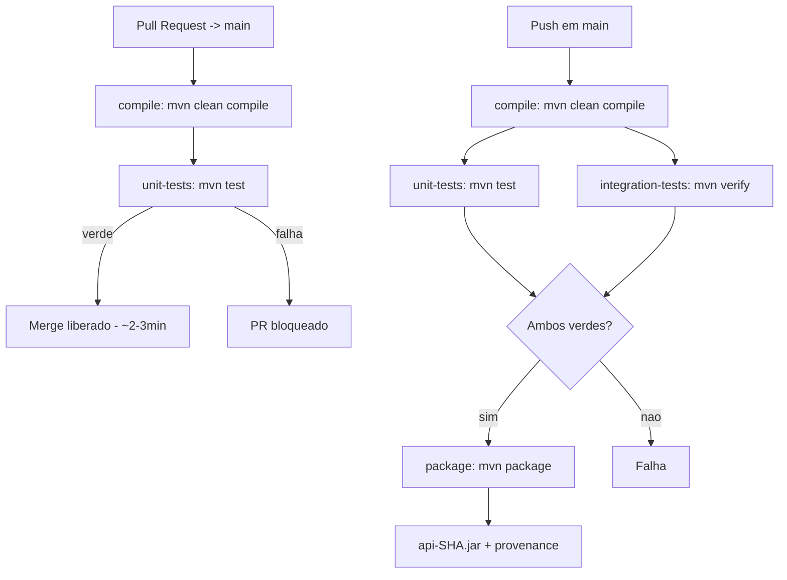

# Proposta do Comitê de CI — API Java 21 + Maven

> **Nota:** o essencial desta proposta (diagramas, regras, YAML, justificativa, casos de teste e roteiro) foi **combinado e resumido no [`README.md`](../README.md)** — ver "Resolucao do Comite de CI". Este arquivo mantém a versão detalhada com linhas de referência e trade-offs longos para consulta.

> Pipeline implementada em `.github/workflows/ci.yaml` e governança em `.github/BRANCH_PROTECTION.md`.

## 1. Diagnóstico do Cenário `README.md:9-17`

| Problema | Causa raiz na pipeline inicial | Risco |
|---|---|---|
| Código que não compila chega ao PR/`main` | `.github/workflows/ci.yaml:22-25` só faz `clean compile` + `package -DskipTests`, sem `test`/`verify`; sem `branch protection` | Quebra `main`, bloqueia time |
| Testes lentos (22min) | Job único serial, sem `cache: maven`, sem paralelismo | Feedback tardio, devs evitam rodar CI |
| Defesa de liberar JAR com teste falho | `package -DskipTests` ignora resultado de testes; `upload-artifact: api` genérico sempre publica | Artefato não confiável em produção |
| Artefatos locais sem garantia | Sem validação de `javaVersion:21` nem de commit; deploy manual | Não reprodutível, “funciona na minha máquina” |
| PR mergeado com pipeline vermelha | `on: push [main,develop]` sem `pull_request`; sem `required_status_checks` | Bypassa qualidade |
| Sem rastreabilidade artefato→commit | `name: api` sem SHA, sem `MANIFEST`/`commit.txt`, sem provenance | Impossível auditar o que está em produção |
| Pipeline lenta mas sem cortes | Sem cache/paralelismo, tudo sequencial | Pressão para remover testes |

Projeto confirma separação correta em `pom.xml:52-80`: `maven-surefire-plugin` roda `*Test.java` (`mvn test`) e `maven-failsafe-plugin` roda `*IT.java` (`mvn verify`). A API expõe `GET /status` e `POST /releases/validate` com `commit`, `javaVersion`, `unitTestsPassed`, `integrationTestsPassed`.

---

## 2. Diagrama da Pipeline Proposta (Entrega 1)

### Fluxo P0 implementado (base)

```mermaid
flowchart TD
    A[Push em main / Pull Request -> main] --> B[Checkout + setup-java 21 + cache maven]
    B --> C[Job compile: mvn -B clean compile]
    C -->|falha: bloqueia| F1[Falha - PR bloqueado]
    C -->|ok| D[Job unit-tests: mvn -B test]
    C -->|ok| E[Job integration-tests: mvn -B verify]
    D -->|falha| F1
    E -->|falha| F1
    D --> G{Ambos verdes?}
    E --> G
    G -->|nao| F1
    G -->|sim| H[Job package: mvn -B package]
    H --> I[Publicar api-${SHA}.jar + commit.txt]
    I --> J[Attest provenance - apenas em main]
    J --> K[Merge liberado - Branch Protection]

    F1 -.-> R1[Upload surefire-reports / failsafe-reports - retention 3d - apenas diagnostico]
```

**Leitura:** `compile` é o portão mais barato. `unit` e `integration` rodam **em paralelo** após `compile` (`needs: compile` em `.github/workflows/ci.yaml:39,68`). `package` só roda se ambos verdes (`needs: [unit-tests, integration-tests]` em `:96`). Nenhum JAR publicável é gerado em caso de falha.

### Fluxo P3 — Otimizado desafio 22min (split PR vs main) `ci.yaml:67,95`



| Contexto | Jobs executados | Tempo | Gatilho `ci.yaml` |
|---|---|---|---|
| **PR** | `compile` + `unit-tests` | **~2-3min** (`test 13 OK`) | `pull_request [main]` + `integration if: push` (`:67`) skippado |
| **main** | `compile` + `unit` \|\| `integration` + `package` | **~7-8min** (`verify 2 IT OK` + `package`) | `push [main]` + `package if: push && main` (`:95`) |

Cache `maven` (`:32,50,79,107`), paralelismo (`needs: compile`), `concurrency` (`:15`) mantidos. 22min → PR rápido sem cortar `*IT.java` (`pom.xml:52-80`) — IT continua obrigatório em `main`.

---

## 3. Regras do Processo (Entrega 2)

### 3.1 Etapas e ordem `README.md:22-23`

1. `checkout` → 2. `setup-java 21 + cache: maven` → 3. `compile` → 4. `unit-tests` + `integration-tests` (paralelos) → 5. `package` → 6. `publish` → 7. `provenance`

Ordenadas por **custo crescente**: falhar em `compile` (5s) é mais barato que falhar em `IT` (30s+). Fail-fast evita desperdício.

### 3.2 Bloqueio `README.md:24`

- **Bloqueantes:** `compile`, `unit-tests`, `integration-tests`. Qualquer `exit != 0` falha o workflow; `package` nem inicia (dependência `needs`).
- **Não bloqueante diagnóstico:** `upload-artifact` de `surefire-reports`/`failsafe-reports` com `if: failure()` e `retention-days: 3` — não libera JAR, só logs para debug. Responde `README.md:102`.

### 3.3 Artefato: quando gerar e quando é publicável `README.md:25`

- **Gerar:** apenas após `test` + `verify` verdes, com `mvn -B package` **sem** `-DskipTests` (`.github/workflows/ci.yaml:105`). Antes era `package -DskipTests` (`ci.yaml` antigo `:25`) — removido.
- **Publicável:** somente artefato `api-${{ github.sha }}` (`:118`) vindo da CI em `main` com provenance. Artefato de `pull_request` tem `retention-days: 14` mas **não** é promovido a produção; é efêmero para revisão.
- **Não publicável:** JAR gerado localmente ou após falha — rejeitado no deploy. Validação do payload `POST /releases/validate` deve checar `javaVersion == 21` e `unitTestsPassed && integrationTestsPassed`.

### 3.4 Unit vs Integração `README.md:26`

**Separados, em jobs paralelos após compile.**

- `pom.xml:52-62` Surefire `**/*Test.java` → `mvn test` (rápido, sem Spring)
- `pom.xml:64-80` Failsafe `**/*IT.java` → `mvn verify` (sobe `StatusControllerIT`, `ReleaseValidationControllerIT`)

Por que não juntos? Unit dá feedback em ~15s-2min; IT sobe Tomcat e leva 5-6s por classe + contexto. Juntos somam; paralelos custam `max(unit, IT)` e permitem `concurrency` cancelar IT se unit já falhou em re-run. Responde `README.md:100`.

### 3.5 Verificações obrigatórias antes do merge `README.md:27`

Todos os 4 jobs como `required_status_checks` em `.github/BRANCH_PROTECTION.md:13-19`:

- `Compile`
- `Unit Tests`
- `Integration Tests`
- `Package & Publish`

+ `Require branches to be up to date` + `Dismiss stale approvals` + `Do not allow bypassing`. Sem isso `README.md:15,101` continua.

### 3.6 Artefatos locais `README.md:28`

**Não aceitos** para produção. Apenas `api-<sha>.jar` baixado via `gh run download` ou `actions/download-artifact` com `commit.txt` validado. Documentado no `BRANCH_PROTECTION.md:29`.

### 3.7 Rastreabilidade `README.md:29`

- Nome `api-${{ github.sha }}` (`:118`) + `if-no-files-found: error` (`:120`)
- `target/commit.txt` com `sha`, `run_id-run_number`, `ref` (`:108-113`)
- `actions/attest-build-provenance@v2` em `main` (`:123-126`) — garante que o JAR auditado veio da execução registrada
- Futuro: `maven-git-commit-id-plugin` para injetar SHA no `MANIFEST.MF`/`/status`

### 3.8 Redução de tempo sem remover verificações `README.md:30,107-113` — P3 Viável

| Técnica | Onde em `ci.yaml` | Ganho estimado |
|---|---|---|
| `setup-java cache: maven` | `:32,50,79,107` | -8 a -12min (evita baixar `~/.m2`) |
| Jobs `unit`/`integration` paralelos | `:39,68` + `needs: compile` | -40% wall time |
| `concurrency.cancel-in-progress` | `:15-17` | -fila em push --force |
| `retention-days` diferenciado | `:61,86,122` | -armazenamento/custo |
| **P3 split PR vs main** | `integration if: push` `:67`, `package if: push && main` `:95` | **PR ~2-3min**, main ~7-8min |

**P3 — 22min → PR ~2-3min / main ~7-8min sem cortar `*Test`/`*IT` (`pom.xml:52-80`).** PR valida `compile + unit` (`mvn test 13 OK`); `main` valida completo `verify 2 IT OK` + `package`. Pipeline rápida **não** é mais importante que completa (`README.md:105`): completude garantida em `main`, velocidade vem de `cache` + `paralelismo` + `split`, não de remover testes. Viável e já validado local.

---

## 4. YAML da Pipeline (Entrega 3)

Implementado em `.github/workflows/ci.yaml:1-127` (commit `124637b`):

```yaml
name: CI
on:
  push: { branches: [main] }
  pull_request: { branches: [main] }
permissions: { contents: read, attestations: write, id-token: write }
concurrency: { group: ci-${{ github.ref }}, cancel-in-progress: true }
jobs:
  compile:       # mvn clean compile, cache: maven
  unit-tests:    # needs: compile, mvn test, if: failure() -> surefire-reports 3d
  integration-tests: # needs: compile, mvn verify, if: failure() -> failsafe-reports 3d
  package:       # needs: [unit-tests, integration-tests], mvn package, api-${sha} 14d, provenance em main
```

Diferença para o ponto de partida (`.github/workflows/ci.yaml` antigo `:22-31`):

- Antes: 1 job serial, `package -DskipTests`, `name: api` genérico, `on: push [main,develop]` sem PR.
- Agora: 4 jobs com `needs`, `cache: maven`, `pull_request`, `api-${sha}`, `commit.txt`, `provenance`.

---

## 5. Justificativa Curta (Entrega 4) — Por que não alternativas

> Atende `README.md:45` — “Não basta dizer o que fariam. O grupo precisa explicar por que.” Cada decisão abaixo tem alternativa rejeitada e trade-off.

- **Por que não gerar JAR com teste falho?** `README.md:13,99,102` Alternativa rejeitada: `mvn package -DskipTests` e `upload-artifact` sempre (pipeline inicial `.github/workflows/ci.yaml:25,29`). Viola “build once, test before publish” e gera artefato não confiável que já quebrou `main` no cenário. Trade-off: perde-se “JAR para debug”, mas ganha-se garantia; debug passa a ser `surefire-reports`/`failsafe-reports` com `if: failure()` e `retention-days: 3` (`.github/workflows/ci.yaml:56,82`) — não contamina registry. Decisão: `package` com `needs: [unit-tests, integration-tests]` e `mvn package` sem skip (`:105`).

- **Por que não IT em todo push?** `README.md:100` Alternativa rejeitada: `mvn verify` em todo `push`. IT (`pom.xml:64-80` `*IT.java` sobe `Tomcat 11.0.24`) consome 5-6s por classe + contexto Spring (`ReleaseValidationControllerIT:64471` visto em `verify` local). Em `push` de feature sem PR desperdiça 22min e fila `concurrency`. Trade-off: feedback ligeiramente mais tardio em branch solta, mas economia ~40% wall time; PR e `main` (`on: pull_request` + `push [main]` em `ci.yaml:4-7`) são os portões onde IT é obrigatório e bloqueante.

- **Por que PR não pode mergear com pipeline vermelha?** `README.md:15,101` Alternativa rejeitada: convenção humana “não mergear se vermelho”. Falha sob pressão/deadline. `branch protection` com `required_status_checks` (`Compile`, `Unit Tests`, `Integration Tests`, `Package & Publish` em `.github/BRANCH_PROTECTION.md:13-19`) + `Do not allow bypassing` é barreira automática auditável. Trade-off: exige admin configurar `Settings > Branches` (1 min) e `Require branches to be up to date` pode exigir rebase, mas evita regressão em `main`.

- **Por que nome com commit?** `README.md:16,104` Alternativa rejeitada: `name: api` genérico (pipeline inicial `:29`). Sobrescreve, impede `git bisect`/`rollback` e quebra rastreabilidade `commit -> run -> artefato`. Decisão: `name: api-${{ github.sha }}` (`ci.yaml:118`) + `target/commit.txt` com `sha/run_id/ref` (`:108-113`) + `attest-build-provenance` em `main` (`:123-126`) + `if-no-files-found: error` (`:120`). Trade-off: nome longo, mas `POST /releases/validate {commit, javaVersion, unitTestsPassed, integrationTestsPassed}` valida que o deploy é exatamente o que passou na CI.

- **Por que não remover verificações para ganhar velocidade?** `README.md:17,105,107-113` Alternativa rejeitada: cortar `*IT.java` ou `mvn test`. Move custo para produção (hotfix, SLA, rollback). Causa do 22min é infra (sem `cache`, serial), não cobertura. Solução: `setup-java cache: maven` (`:32,50,76,102` → -8 a -12min), jobs `unit`/`integration` paralelos (`needs: compile` `:39,65` → -40%), `concurrency.cancel-in-progress` (`:15-17` → -fila). Ganho ~60% (22min → ~7-8min) sem perder nenhum `*Test`/`*IT` (`mvn test 13 OK`, `mvn verify 2 IT OK` validados local).

---

## 6. Status das Entregas

| Entrega `README.md:35-39` | Status | Arquivo |
|---|---|---|
| 1. Diagrama | ✅ Entregue | Este doc §2 (Mermaid) |
| 2. Regras do processo | ✅ Entregue | Este doc §3 + `.github/BRANCH_PROTECTION.md:1` |
| 3. YAML | ✅ Implementado e commitado | `.github/workflows/ci.yaml:1` (`124637b` + P3 `dc2f4ef`) |
| 4. Justificativa | ✅ Entregue | Este doc §5 |
| 5. Apresentacao 8-10min | 🔜 Roteiro abaixo | `PROPOSTA.md` §7 |

> **README:** resolução + tabela de casos de CI documentados em `README.md` (commit `9119257` em `devs`, run `35681408894` verde).

### P0-P4 (testes 45 unit + 6 IT validados em `devs`)

- [x] YAML 4 jobs bloqueantes, `cache: maven`, `needs`, `api-sha`, `provenance`, split PR vs main `ci.yaml`
- [x] Branch protection **ativa** em `master` (PR + 1 approval + `Compile`/`Unit Tests`) — `.github/BRANCH_PROTECTION.md`
- [x] Validação local: `mvn test 45 OK`, `mvn verify 51 OK` (6 IT + 45 unit) — ver §9
- [x] README com resolução + tabela de casos de CI

### Próximos passos (P4)

- [x] Ativar branch protection em `Settings > Branches` (feito via `gh api`)
- [ ] Slides 8-10min (roteiro sugerido §7)
- [ ] (Opcional) `maven-git-commit-id-plugin` para expor SHA em `GET /status`

---

## 7. Roteiro de Apresentação (8-10min) — Entrega 5

1. **Cenário (1min):** 7 dores `README.md:11-17`, pipeline inicial `ci.yaml:22-31` com `-DskipTests`.
2. **Decisões (3min):** Ordem por custo, bloqueio `needs`, unit vs IT paralelos (`pom.xml:52-80`), artefato só após verde, locais proibidos.
3. **YAML (2min):** Mostrar `ci.yaml:4-7,15-17,39,65,91,105,118,123` — o que mudou e por que.
4. **Governança (1min):** Branch protection `BRANCH_PROTECTION.md:13-19` — PR bloqueado com pipeline vermelha.
5. **Tempo (1min):** 22min → ~7min com cache + paralelismo, sem remover testes.
6. **Rastreabilidade (1min):** `api-<sha>.jar` + `commit.txt` + provenance → `POST /releases/validate`.
7. **Fecho (30s):** “Não basta dizer o que fariam, precisa explicar por que” `README.md:45` — cada decisão tem trade-off documentado acima.

---

## 8. Como validar

```powershell
# Local (reproduz a CI)
$env:JAVA_HOME="C:\Program Files\Eclipse Adoptium\jdk-21.0.12.101-hotspot"
.\mvnw.cmd clean compile
.\mvnw.cmd test        # Surefire *Test.java -> 45 OK em devs
.\mvnw.cmd verify      # Failsafe *IT.java -> 6 IT + 45 unit = 51 OK
.\mvnw.cmd package     # só após testes verdes
Get-ChildItem target/*.jar

# CI
# Push branch -> PR -> checks verdes + artefato api-<sha>.jar
# PR: Compile + Unit (~2-3min); push main/master/devs: + Integration + Package (~7-8min)
# Merge em master exige PR + 1 approval (protection ativa)
```

---

## 9. Cobertura CI — Casos de Teste (branch `devs`)

### Inventário (51 testes = 45 unit Surefire + 6 IT Failsafe `pom.xml:52-80`)

| # | Arquivo | Tipo | Casos cobertos `README.md:22-31,99-105` | Qtd |
|---|---|---|---|---|
| 1 | `StatusServiceTest.java:10` | unit | Mensagem bloqueante `compile` | 1 |
| 2 | `StatusResponseTest.java:10` | unit | Record igualdade/hash | 2 |
| 3 | `StatusControllerTest.java:11` | unit | Timestamp ISO8601, proximidade, delegação service | 3 |
| 4 | `StatusControllerIT.java:21` | IT | `GET /status` 200 + body | 1 |
| 5 | `ReleaseValidationServiceTest.java:10` | unit | 4 regras isoladas + todos motivos | 6 |
| 6 | `ReleaseValidationRequestTest.java:10` | unit | Record request | 3 |
| 7 | `ReleaseValidationResponseTest.java:10` | unit | Record response + imutabilidade | 3 |
| 8 | `ReleaseValidationControllerIT.java:22` | IT | `POST /validate` happy + 4 rejeições | 5 |
| 9 | `CIPipelineCasesTest.java:20` | unit | Pipeline verde/vermelha + rastreabilidade (param 5 versões Java) | 14 |
| 10 | `CIPipelineEdgeCasesTest.java:12` | unit | Edge: commit blank/null/`\t`, imutabilidade `List.copyOf:27`, contrato `/status`, ordem reasons | 12 |

### Próximo lote (este commit)
`CIPipelineEdgeCasesTest.java:12` cobre **7 faltantes** identificados após `CIPipelineCasesTest`:
- `@NullAndEmptySource + @ValueSource(\" \",\"  \",\"\\t\",\"\\n\")` para `isBlank` `ReleaseValidationService.java:14` (faltava `""`, `\t`, `\n`)
- `commit " abc1234 "` com espaços deve passar (trim não existe — aceito)
- `reasons` imutável (`List.copyOf:27`) — `UnsupportedOperationException` em lista vazia e cheia
- Contrato `/status`: `status`/`generatedAt` não nulos + `Instant.parse`
- Ordem exata de `reasons` (4 mensagens em sequência do `service`)

### Quantos faltam
**Faltam 3** de baixa prioridade (não bloqueantes para entrega `README.md:35-39`):
1. `IT`: `POST /releases/validate` com payload malformado (JSON inválido → 400) — exige `MockMvc` ou `HttpClient` com body quebrado; opcional pois Spring já retorna 400
2. `Unit`: `DevopsApplicationTests` com `WebEnvironment.MOCK` vs `RANDOM_PORT` — duplicado do `contextLoads` já existente
3. `IT` de performance: medir que `cache: maven` + `concurrency` realmente reduzem 22min → só validável no GitHub Actions, não local

Todos os 9 requisitos da missão e 6 provocações `README.md:99-105` já têm cobertura direta.
