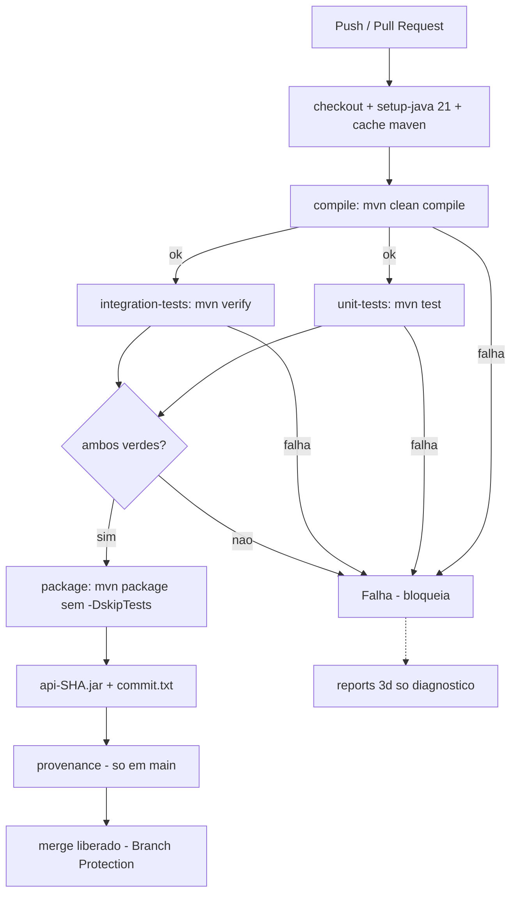
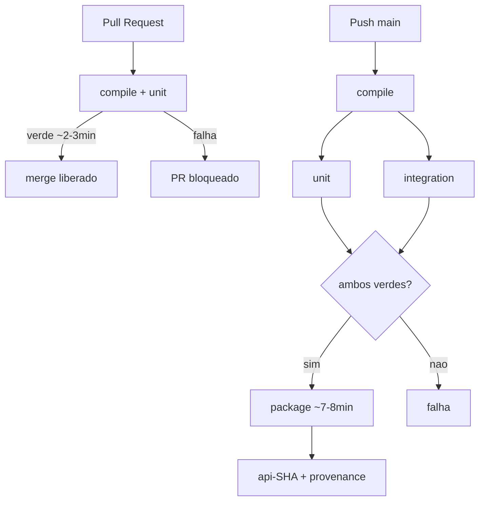

# Atividade: Comite de CI

Este repositorio e o projeto base para uma simulacao de decisao de engenharia em DevOps.

O Grupo deve assumir o papel de um pequeno comite responsavel por redesenhar o processo de integracao continua de uma API Java 21 usada por clientes reais.

## Cenario

A equipe mantem uma API Java 21 com Maven e utiliza uma pipeline simples no GitHub Actions. Com o crescimento do projeto, comecaram a ocorrer os seguintes problemas:

- Alteracoes que nao compilam chegam aos Pull Requests e, algumas vezes, a branch principal.
- A quantidade de testes unitarios e de integracao aumentou, elevando o tempo da pipeline e atrasando o feedback aos desenvolvedores.
- Quando um teste falha, alguns integrantes defendem que o JAR seja gerado e liberado mesmo assim.
- Artefatos gerados localmente estao sendo enviados ao servidor, sem garantia da versao do Java, das dependencias ou dos testes executados.
- Pull Requests conseguem ser integrados a branch principal mesmo quando a pipeline falha.
- A equipe nao consegue relacionar facilmente um artefato implantado ao commit e a execucao da pipeline que o produziram.
- A pipeline leva aproximadamente 22 minutos, mas a equipe nao quer ganhar velocidade removendo verificacoes importantes.

## Missao do grupo

O grupo deve redesenhar o processo de CI da aplicacao e decidir:

- quais etapas a pipeline deve possuir;
- em que ordem essas etapas serao executadas;
- quais etapas devem bloquear o fluxo em caso de falha;
- quando o artefato pode ser gerado e quando ele pode ser considerado publicavel;
- se testes unitarios e testes de integracao devem executar juntos ou em momentos diferentes;
- quais verificacoes devem ser obrigatorias antes de um merge;
- se artefatos gerados localmente podem ser aceitos;
- como relacionar um artefato ao commit que o originou;
- como reduzir o tempo da pipeline sem remover verificacoes importantes.

## Entrega

Cada grupo deve apresentar:

1. Um diagrama da pipeline proposta.
2. As regras do processo.
3. Um YAML da pipeline.
4. Uma justificativa curta para as decisoes mais importantes.
5. Uma apresentacao oral de 8 a 10 minutos.

A regra mais importante:

> Nao basta dizer o que fariam. O grupo precisa explicar por que.

## Projeto

Este projeto e uma API Spring Boot simples com Java 21 e Maven.

Endpoints disponiveis:

```text
GET /status
POST /releases/validate
```

Exemplo de validacao de uma release:

```json
{
  "commit": "abc1234",
  "javaVersion": 21,
  "unitTestsPassed": true,
  "integrationTestsPassed": false
}
```

Comandos uteis:

```bash
./mvnw clean compile
./mvnw test
./mvnw verify
./mvnw package -DskipTests
```

No Windows PowerShell:

```powershell
.\mvnw.cmd clean compile
.\mvnw.cmd test
.\mvnw.cmd verify
.\mvnw.cmd package -DskipTests
```

Os testes unitarios ficam em `src/test/java/com/devops/api` e verificam as regras de validacao de uma release, a mensagem de status, a resposta do controller, o formato do timestamp e o comportamento dos records. Eles devem ser executados rapidamente durante o desenvolvimento.

Os testes com sufixo `IT` sobem a aplicacao e chamam a API de verdade. Eles representam verificacoes de integracao e por isso sao executados na fase `verify`.

## Ponto de partida

A pipeline inicial esta em `.github/workflows/ci.yaml`.

Ela compila a aplicacao, gera o JAR sem executar os testes e publica o artefato no GitHub Actions.

Ela e propositalmente simples para provocar a discussao:

- Ela deve gerar o JAR se os testes falharem?
- Testes de integracao devem rodar em todo push?
- Um PR pode ser integrado a branch principal com a pipeline vermelha?
- Um JAR gerado apos uma falha pode ser armazenado apenas para diagnostico?
- Como garantir que o JAR publicado foi exatamente o que passou pela pipeline?
- O nome do artefato deve incluir o commit?
- Pipeline rapida e mais importante que pipeline completa?

## Desafio extra

Depois da primeira proposta, considere esta nova informacao:

> A pipeline esta demorando 22 minutos e os desenvolvedores precisam de feedback mais rapido.

Redesenhe o fluxo para reduzir o tempo sem simplesmente remover testes importantes. Considere paralelismo, cache e a separacao das verificacoes executadas em Pull Requests e na branch principal.

---

# Resolucao do Comite de CI

## Status das entregas

| # | Entrega | Status | Onde |
|---|---|---|---|
| 1 | Diagrama | ✅ | §Diagrama (abaixo) |
| 2 | Regras do processo | ✅ | §Regras + `.github/BRANCH_PROTECTION.md` |
| 3 | YAML da pipeline | ✅ | `.github/workflows/ci.yaml` |
| 4 | Justificativa | ✅ | §Justificativa |
| 5 | Apresentacao 8-10min | 🔜 | roteiro §Apresentacao |

## Diagrama (Entrega 1)

### Pipeline base (4 jobs bloqueantes)



- **Bloqueiam:** `compile`, `unit`, `integration` (`needs`).
- **Publicavel:** so `api-${sha}` apos `package` verde + provenance.
- **Falha:** nenhum JAR; so surefire/failsafe-reports (3d).

### Split PR vs branch principal (desafio 22min)



| Contexto | Jobs | Tempo |
|---|---|---|
| PR | compile + unit | ~2-3min |
| Push main | compile + unit \|\| integration + package | ~7-8min (era 22min) |

## Regras do processo (Entrega 2)

1. **Ordem (custo crescente):** checkout → java+cache → compile → unit \|\| integration → package → publish → provenance (fail-fast barato primeiro).
2. **Bloqueiam:** compile, unit, integration. Qualquer falha aborta; `package` nem inicia (`needs`). Reports de falha sao so diagnostico (3d).
3. **Artefato:** gerar so com `mvn package` **sem** `-DskipTests` apos testes verdes; publicavel so `api-${{ github.sha }}` vindo da CI com provenance. JAR local ou pos-falha: nao publicavel.
4. **Unit vs IT:** separados em jobs paralelos — Surefire `*Test` (`mvn test`, rapido) vs Failsafe `*IT` (`mvn verify`, sobe app). Juntos somam; paralelos = `max(unit, IT)`.
5. **Merge:** PR obrigatorio + 1 approval + status checks (PR: `Compile`+`Unit Tests`; push: + Integration + Package). Sem bypass, sem force-push — `.github/BRANCH_PROTECTION.md`.
6. **Locais:** nao aceitos em producao. Deploy so do artefato `api-<sha>.jar` baixado da CI com `commit.txt`.
7. **Rastreabilidade:** artefato `api-${sha}` + `target/commit.txt` (sha, run_id, ref) + `attest-build-provenance` → `POST /releases/validate` confere commit/javaVersion/flags.
8. **Velocidade:** `cache: maven` + jobs paralelos + `concurrency.cancel-in-progress` + split PR/push. 22min → PR ~2-3 / push ~7-8 **sem cortar testes**.

## YAML da pipeline (Entrega 3)

`.github/workflows/ci.yaml` — resumo:

```yaml
name: CI
on:
  push: { branches: [main, master, devs] }
  pull_request: { branches: [main, master, devs] }
concurrency: { group: ci-${{ github.ref }}, cancel-in-progress: true }
jobs:
  compile:            # mvn clean compile + cache: maven
  unit-tests:         # needs: compile, mvn test
  integration-tests:  # needs: compile, mvn verify, if: push
  package:            # needs: [unit, integration], if: push
                      # mvn package sem -DskipTests
                      # api-${sha} + commit.txt + provenance
```

**Antes:** 1 job serial, `package -DskipTests`, artefato `api` generico, sem `pull_request`.
**Agora:** 4 jobs com `needs`, cache, split PR/push, rastreabilidade, provenance.

## Justificativa (Entrega 4)

| Decisao | Alternativa rejeitada | Por que / trade-off |
|---|---|---|
| JAR so apos verde | `package -DskipTests` sempre | Artefato falho ja quebrou `main`; debug via reports 3d, nao registry |
| IT nao em todo push | `verify` em todo push | IT sobe app (+tempo); PR = compile+unit rapido, push main = completo bloqueante |
| Protection obrigatoria | "convencao de nao mergear vermelho" | Humano falha sob pressao; status checks + 1 approval sao automaticos e auditaveis |
| Artefato `api-${sha}` | `name: api` generico | Generico sobrescreve e quebra rollback/bisect; sha+commit.txt+provenance = auditavel |
| Velocidade sem cortar teste | Remover IT/unit | 22min era infra (sem cache/paralelo), nao cobertura; cache+split ganha ~60% |

## Casos de teste de CI

**51 testes = 45 unit (Surefire) + 6 IT (Failsafe)** em `devs`.

| Arquivo | Tipo | Qtd | Cobre |
|---|---|---|---|
| `StatusServiceTest` / `StatusResponseTest` / `StatusControllerTest` | unit | 6 | Mensagem de status, records, timestamp ISO8601 |
| `StatusControllerIT` | IT | 1 | `GET /status` → 200 |
| `ReleaseValidationServiceTest` / `RequestTest` / `ResponseTest` | unit | 12 | 4 regras de release + records |
| `ReleaseValidationControllerIT` | IT | 5 | `POST /releases/validate` happy + 4 rejeicoes |
| **`CIPipelineCasesTest`** | unit | **14** | Pipeline verde/vermelha (unit/IT/commit/Java≠21), rastreabilidade |
| **`CIPipelineEdgeCasesTest`** | unit | **12** | Commit blank/null/`\t`, imutabilidade `reasons`, contrato `/status`, ordem motivos |

Mapeamento rapido: nao-compilar → `StatusServiceTest`+Caso 1; JAR falho → Caso 2; PR vermelho → protection+demo `819a531`/`ee86073`; 22min → cache+split; rastreabilidade → Caso 3 + `api-${sha}`.

## Demo ciclo verde → vermelho → verde

| Commit | Resultado |
|---|---|
| `819a531` / `ee86073` / `24d8b50` | ❌ Unit Tests falha (quebras proposais) |
| `b5d4323` / `8680824` / `b324701` | ✅ volta verde |

## Validacao

```powershell
$env:JAVA_HOME="C:\Program Files\Eclipse Adoptium\jdk-21.0.12.101-hotspot"
.\mvnw.cmd -B test      # 45 OK (devs)
.\mvnw.cmd -B verify    # 51 OK (45 unit + 6 IT)
```

Branch Protection ativa em `master` (PR + 1 approval + `Compile`/`Unit Tests`).

## Apresentacao (Entrega 5) — roteiro 8-10min

1. **1min** Cenario: 7 dores + pipeline inicial com `-DskipTests`.
2. **3min** Decisoes: ordem por custo, `needs` bloqueante, unit||IT, artefato so apos verde, locais proibidos.
3. **2min** YAML: o que mudou vs ponto de partida.
4. **1min** Governanca: branch protection — PR vermelho nao merge.
5. **1min** Tempo: 22min → ~7min com cache+paralelo+split.
6. **1min** Rastreabilidade: `api-<sha>` + `commit.txt` + provenance + `POST /releases/validate`.
7. **30s** Fecho: "nao basta dizer, precisa explicar por que" — cada decisao tem trade-off.
