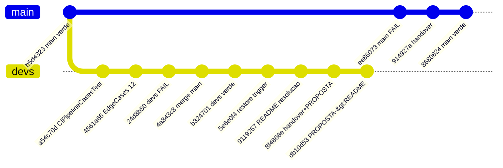

# Handover — Próxima Sessão de Código

> Atualizado 2026-09-22 — branch principal renomeada `master` → `main`. Estado **verde** em `main` e `devs`.

## 1. Onde estamos

| Branch | HEAD | Estado | CI `ci.yaml:5` |
|---|---|---|---|
| `main` | `8680824` `fix(ci): restaura StatusServiceTest` | **Verde** Actions run `35680735698` success | `push [main,devs]` → 4 jobs ✅ |
| `devs` | `db10d53` `docs: combina PROPOSTA no README` | **Verde** `mvn test 45 OK` + `verify 51 OK` | mesmos 4 jobs ✅ |
| Branch Protection | `main` | **Ativa** via API (após rename): PR obrigatório (1 approval), checks `Compile`+`Unit Tests` (strict), no force-push, enforce_admins | — |



## 2. Feito nesta sessão

1. **Voltar ao verde** ✅ — restores em `main`/`devs`; JDK 21 Temurin via winget
2. **Actions verdes** ✅ — runs `35680735698` (main), `35681408894`+ (devs)
3. **Branch Protection** ✅ ativa em `main` — checks PR: `Compile`+`Unit Tests`
4. **README combinado** ✅ — PROPOSTA resumida no `README.md` (diagramas, regras, justificativa, tabela de testes)
5. **Rename master → main** ✅ — branch remota, default branch, protection e PR #1 atualizados

**Bug histórico:** merge `4a843c8` removeu `devs` de `ci.yaml` — restaurado em `5e6e0f4`.

## 3. Próxima sessão — Checklist

1. **PR #1 `devs`→`main`:** https://github.com/rodrigosantoscosta/devops/pull/1 — checks verdes, `REVIEW_REQUIRED` (sem self-approve)
2. **P4 Slides 8-10min:** roteiro no `README.md` §Apresentacao
3. **Opcional:** `maven-git-commit-id-plugin`; 3 testes de baixa prioridade (`PROPOSTA.md` §9)

## 4. Comandos úteis

```powershell
$env:JAVA_HOME="C:\Program Files\Eclipse Adoptium\jdk-21.0.12.101-hotspot"
$env:Path="$env:JAVA_HOME\bin;$env:Path"
.\mvnw.cmd -B clean verify   # 51 OK em devs
gh run list --limit 5
gh run watch <run-id> --exit-status
```

## 5. Riscos

- Protection em `main` com `enforce_admins: true` — pushes diretos em `main` rejeitados; fluxo = PR → review → merge
- **Self-approve proibido** — merge de PR #1 precisa de 2ª identidade/reviewer
- JDK local: Temurin 21 (winget)

## 6. Contatos

Repo: `https://github.com/rodrigosantoscosta/devops.git` · `comite-ci@devops.local`
Pipeline: `.github/workflows/ci.yaml` · Regras: `README.md` §Regras · Protection: `.github/BRANCH_PROTECTION.md`
